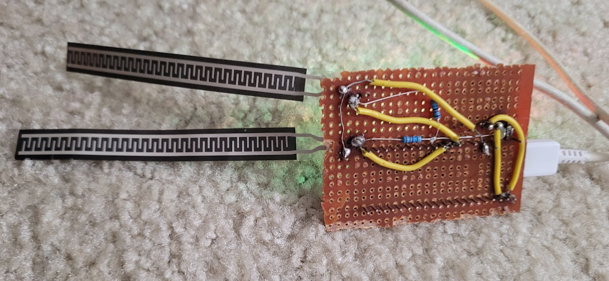
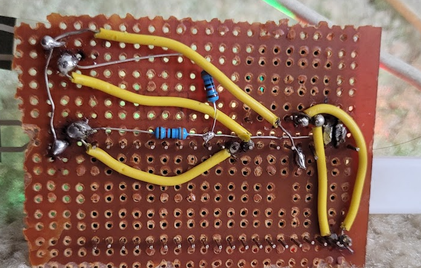

# Invisiglove
So this is basically a glove with flex sensors, a gyroscope, and a accelerometer, so it can tell exactly what your hand's position is at all times. I think that this will allow for some pretty interesting use cases, like an invisible keyboard, a mouse, game conrol, ro pretty much just make it into any input devise for you laptop. This sort of reminds me of the nintendo controllers for we, except it has a lot more detail, and is fit to your hand.
To build this I am going to use:
A raspberry pi, gyroscope, lipo battry, a bluetooth module, and flex sensors. I know that some people were able to DIY flex sensors, when I tried to in the past they were useually unreliable, so this time I will stick to buying them. Most of the components are pretty flexible,and were mainly just what I had on hand. 

# THe wiring
SO I just connected the flex sensors to the 26,27, and 28 pings, a pullup resistor to ground, and connected to 3.3 V. Then I also connected the gyroscope to pin 0, and 1.

# The setup
SO after you wire it up, you can upload the code final.py, and adjust the sensitivity of the flex sensors so that you can seperate bent from strait. Then I just pulled a gloves overit, fit it to my hand, and then it is basically what ever you can code it to do.

